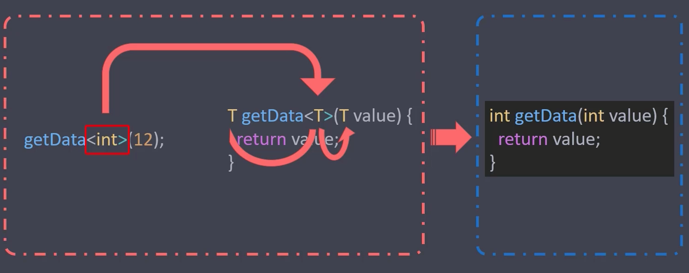
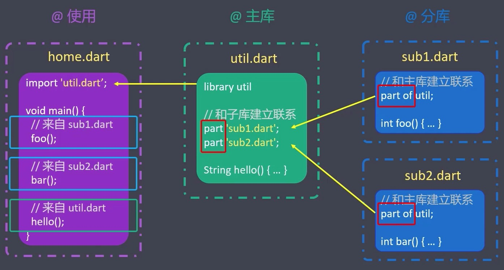

# 概述

## 简介

- Dart 是Google开发的，**类型安全**的，**面向对象**的编程语言，被应用于 **Wen、服务器、移动应用和物联网**等领域。
- Dart 诞生于 2011年10月10日
- Dart 简单易学（类似TypeScrip，是强类型的语言）
- 运行方式
  - 原生虚拟机（Dart 代码可以运行在Windows，Mac、Linux上）
  - JavaScript 引擎（Dart 代码可以转成JS代码，然后运行在浏览器上）

## 资源

要学习Flutter的话我们必须首先得学会Dart。

- 官网
  - 中文：https://dart.dev/
  - 英文：https://dart.cn/
- 在线运行代码
  - https://dartpad.cn
- 生态
  - https://pub.dev

## 对比

| Dart            | JavaScript        |
| --------------- | ----------------- |
| Flutter         | React             |
| https://pub.dev | https://npmjs.com |
| pub             | npm               |

## SDK 安装

### windows

[下载安装工具包 >>](https://gekorm.com/dart-windows/)

安装完成后在 `CMD` 输入 `dart --version` 出现版本号则表示安装成功。

### macOS

```shell
 $ brew tap dart-lang/dart
 $ brew install dart
```

> **！注意**：由于 Flutter-SDK 自带 Dart，如果你已安装 Flutter-SDK，则无需在安装。

## IDE

### Vscode（推荐）

安装扩展：

- `Dart`
- `Code Runner`


### Android Studio

创建纯 dart 项目流程大致如下：

1）创建必要目录文件

```shell
$ mkdir dart-learns && cd dart-learns
$ touch main.dart
```

2）将 `dart-learns` 拖至 Android Studio 即可。

3）配置 `dart-sdk`

# Dart 语法基础

先从一个函数开始：

```dart
// 声明函数
void printInteger(int aNumber) {
  // 打印到控制台
  print("The number is $aNumber.");
}

// 入口文件-应用从这里开始这行
void main() {
  //  声明并初始化一个变量
  var number = 30;
  // 调用函数
  printInteger(number);
}
```

- 注释语法与 JS 一致；
- 声明函数不需要关键字（JS 中通过 `function` 关键字来声明函数）；
- 函数和参数前面都有类型声明，`void` 表示没有返回值， `int` 是整型数字；
- 打印使用 `print`（JS 使用 `console.log()`）；
- 每行代码结束时，必须写结束分号（`;`）；
- 字符串通过引号包起来，支持模板字符串；
- `main` 是入口函数，Dart 应用程序总是从 `main` 函数开始执行；

- 用 `var` 声明的变量，其数据类型是动态的；

## 注释

- 单行注释：`// 我是单行注释`
- 多行注释：`/* 我是多行注释 */`
- 文档注释：`/// 我是文档注释` （Tips：文档注释支持 markdown 语法）

## 变量

- 变量是一个引用，Dart万物皆对象，变量存储的是对象的引用
- 声明变量
  - 明确指定类型：`int age = 18`
  - 不明确类型：`var age = 18` 或 `dynamic age = 18`
- 变量名大小写敏感（`age` 与 `Age` 是两个不同的变量）
- 变量默认值是 `null`（JS 中变量默认值是 `undefine`）
- Dart 变量的值不会进行隐式转换（`null` 不会自动转成 `false`）

## 常量

- 常量就是值不可变的变量（一旦声明，其值不能更改）

- 声明常量：

  ```dart
  const age = 18;
  final age = 18;
  
  ```

- `const` 与 `final` 的区别

  ```dart
  const time = DateTime.now(); // 报错 - 无法将运行时的值分配给 const 变量（编译时）
  final time = DateTime.now(); // 成功 - 可以将运行时的值分配给 final 变量（运行时）
  ```


# Dart 数据类型

- 基本类型：`int`、`double`、`String`、`bool`
- 对象类型：`List`、`Set`、`Map`

## Number

Dart 中的数字由三个关键字描述

- `num` 数字类型（既可以是整数，也可以是小数）
  - `int` 表示整数（必须是整数）
  - `double` 表示浮点数（既可以是整数，也可以是小数）
- 常用API
  - https://api.dart.cn/stable/dart-core/num-class.html
  - https://api.dart.cn/stable/dart-core/int-class.html
  - https://api.dart.cn/stable/dart-core/double-class.html

## String

- 声明字符串
  - 单引号、双引号都可以
  - 三个引号可以声明包含换行符的字符串
- 常见API
  - https://api.dart.cn/stable/dart-core/String-class.html
- 正则表达式
  - `RegExp(r'正则表达式')`
  - `RegExp(r'\d+')`

## Boolean

- Dart 通过 `bool` 关键字来表示布尔类型

- 布尔类型只有两个值：`true` 和 `false`

- 对变量进行判断时，要显示地检查布尔值

  ```dart
  if(varname){...} // Wrong
  if(varname == 0) {...} // OK
  if(varname == null) {...} // OK
  ```

## List

- Dart 中的数组，由 `List` 对象表示。List 有两种声明方式：

  ```dart
  // 字面量方式
  List list = []; // 不限定元素的数据类型
  List list = <int>[]; // 限定元素的数据类型是 int
  // 构造函数方式
  List list = new List.empty(growable: true); // 不限制长度的空列表
  List list = new List.filled(3, 0); // 声明指定长度的填充列表

- 扩展操作符 （`...`）

  ```dart
  var list1 = [1, 2, 3];
  var list2 = [0, ...list]; // - [0, 1, 2, 3]
  ```

- 常用 API

  - https://api.dart.cn/stable/dart-core/List-class.html

- 遍历数组

  - `forEach()`：遍历列表
  - `map()`：遍历并处理元素，然后生成新的列表
  - `where()`：返回满足条件的数据，类似于 `filters`
  - `any()`：只要有一项满足条件，即返回 `true`
  - `every()`：判断是否每一项都满足条件，都满足条件才返回 `true`

## Set

- Set 是一个无序的，元素唯一的集合
- Set 有字面量和构造函数两种声明方式（**字面量中用大括号**）
- 无法通过下标取值
- 具有集合特有的操作
  - 例如：求交集、并集、差集等
- 常用 API
  - https://api.dart.cn/stable/dart-core/Set-class.html

## Map

- Map 是一个无序的 **键值对（`key-value`）映射**。通常被称为 **哈希** 或 **字典**。

- 声明方式

  ```dart
  // 字面量
  var map = { key1: value1, key2: value2 };
  // 构造函数
  var map = new Map();
  map['key'] = value;
  ```

- 常用 API

  - https://api.dart.cn/stable/dart-core/Map-class.html

## 其他

- Runes（符文）
  - Runes 对象是一个32位字符对象。它可以把文字转换成 **符号表情** 或 **特定的文字**。
  - `print("\u{1f44d}")`  → 👍
  - https://copychar.cc/
- Symbol
  - 在 Dart 中使用 `#` 开头来表示的标识符
- dynamic
  - 动态数据类型

# Dart 运算符与表达式

- 算数运算符：`+`、`-`、`*`、`/`、`%`
- 关系运算符：`>`、`==`、`<` ...（提示：不支持 `===`）
- 逻辑运算符：`&&`、`||`、`！`
- 赋值运算符：`=`
- 复合运算符：`+=`、`*=` ....
- 三元运算符：`?:`
- 地板除：`~/`，对除法运算的结果做向下取整的操作*（Dart特有）*
- 类型判断运算符：`is | is!`，类似于JS中的 `instanceof`*（Dart特有）*
- 避空运算符：`?? | ??=`，如果变量为空，才赋值*（Dart特有）*
- 条件属性访问：`?.`*（Dart特有）*
- 级联运算符：`..`*（Dart特有）*
  - `myObject.myMethod()` → 返回 `myMethod` 的返回值
  - `myObject..myMethod()` → 返回 `myObject` 对象的引用

# Dart 程序结构

- 分支语句：`switch`
- 条件语句：`if-else`

- 循环语句：`for`、`while`、`do...while`

# Dart 函数

## 声明函数

- 直接声明
  - Dart 中声明函数不需要 `function` 关键字
- 箭头函数
  - Dart 中的箭头函数，**函数体只能写一行且不能带有结束的分号**
  - Dart 中的箭头函数，只是函数的一种简写形式
- 匿名函数
- 立即执行函数

代码示例：

```dart
// Dart 中声明函数，不需要 function 关键字
void printInfo() {
  print("Hello, World!");
}

// 返回值，与函数声明的类型要一致
int getNum() {
  return 1;
}

void main(List<String> args) {
  // -- 调用函数
  printInfo();
  print(getNum());

  // -- 匿名函数
  var myPrint = (value) {
    print(value);
  };
  List fruits = ['apple', "banana", "watermelon"];
  fruits.forEach(myPrint);

  // -- 箭头函数
  fruits.forEach((element) => print(element) /*箭头函数中，不能写结束的分好(;)，花括号可省略*/);

  // -- 立即执行函数
  ((String name) {
    print("Hello, $name!");
  })("Lee");
}
```

## 函数参数

- 必填参数：参数类型 参数名称，如 `int a`
- 可选参数
  - 放在必填参数后面
  - 通过 **中括号** 包裹起来
  - 带默认值的可选参数
- 命名参数
  - 用 **大括号** 包裹起来
  - 调用函数时，命名参数的名称与声明函数中的名称保持一致
- 函数参数

代码示例：

```dart
void main(List<String> args) {
  // -- 必填参数
  String userInfos1(String name) {
    return "你好：$name";
  }

  String res1 = userInfos1("张三");
  print(res1);

  // -- 可选参数
  String userInfos2(String name, [int age = 0]) {
    return "你好：$name，年龄：$age";
  }

  String res2 = userInfos2("张三", 20);
  print(res2);

  // -- 命名参数
  String userInfos3(String name, {int age = 0}) {
    return "你好：$name，年龄：$age";
  }

  /** 命名函数调用时，需要与声名时的形参一致 */
  String res3 = userInfos3("张三", age: 20);
  print(res3);

  // -- 函数参数
  var myPrint = (value) {
    print(value);
  };
  List fruits = ['apple', "banana", "watermelon"];
  /** 将匿名函数 myPrint 传递给函数 forEach */
  fruits.forEach(myPrint);
}
```

## 作用域与闭包

1）作用域

```dart
void main(List<String> args) {
  Function funA() {
    print('funA');
    Function funB() {
      print('funB');
      void funC() {
        print('funC');
      }

      return funC;
    }

    return funB;
  }

  var a = funA();
  var b = a();
  b(); // funC
}
```

作用域链：`Global` → `funA` → `funB` → `funC`

> **！提示：** Dart 中的作用域与 JavaScript 一致。

2）闭包

- Dart 中闭包的实现方式与 JavaScript 完全一致
- 使用时机：既能重用变量，又能保护变量不被污染
- 实现原理：外层函数被调用后，外层函数的作用域对象（AO）被内层函数引用着，导致外层函数的作用域对象无法释放，从而形成闭包。

代码示例：

```dart
// 全局变量
var globalNum = 100;
void main(List<String> args) {
  // -- 作用域
  printInfo() {
    // 局部变量
    var localNum = 10;
    print(localNum);
    print(globalNum); // 可以再函数作用域中，访问全局变量
  }

  printInfo();
  // print(localNum); // 不能在全局作用域中，访问局部变量

  // -- 闭包
  parent() {
    var money = 1000;
    return () {
      money -= 100;
      print(money);
    };
  }

  var p = parent();
  p(); // 900
  p(); // 800
  p(); // 700
}
```

## 异步函数

- JavaScript 中，异步调用通过 `Promise` 来实现
  - `async` 函数返回一个 `Promise`，`await` 用于等待 `Promise`
- Dart 中，异步调用通过 `Future` 来实现
  - `async` 函数返回一个 `Future`，`await` 用于等待 `Future`
- Future 详情：
  - https://api.dart.dev/stable/dart-async/Future-class.html

代码示例1：`then` 写法

```dart
// → https://pub.flutter-io.cn/packages/http
import 'package:http/http.dart' as http;
import 'dart:convert';

Future getIPAddress() {
  final uri = Uri.parse('https://httpbin.org/ip');
  return http.get(uri).then((response) {
    String ip = jsonDecode(response.body)['origin'];
    return ip;
  });
}

void main(List<String> args) {
  // 调用 getIPAddress
  getIPAddress()
      .then((ip) => print("IP：$ip"))
      .catchError((error) => print(error));
}
```

代码示例2：`async` 写法

```dart
// → https://pub.flutter-io.cn/packages/http
import 'package:http/http.dart' as http;
import 'dart:convert';

Future getIPAddress() async {
  final uri = Uri.parse('https://httpbin.org/ip');
  final response = await http.get(uri);
  String ip = jsonDecode(response.body)['origin'];
  return ip;
}

void main(List<String> args) async {
  // 调用 getIPAddress
  try {
    final ip = await getIPAddress();
    print("IP：$ip");
  } catch (error) {
    print(error);
  }
}
```

# Dart 类与对象

## 类

- 类是通过 `class` 声明的代码段，包含属性和方法
  - 属性：用来描述类的变量
  - 方法：类中的函数称为类的方法
- 对象是类的 **实例化** 结果，如：`var obj = new MyClass()`
- 类是对象的抽象，对象是类的具体实现
- 编程方式
  - 面向对象编程（OOP）
  - 面向过程编程（POP）

代码示例：

```dart

// 声明类
class Person {
  // 类的属性
  String name = "张三";
  // 类的方法
  void sayHello() {
    print("Hello，$name！");
  }
}

void main(List<String> args) {
  // 实例化类，然后得到一个对象
  Person p = new Person();

  // 访问类中的属性
  print(p.name);

  // 访问类的方法
  p.sayHello();

  // Dart 中 所有的内容都是对象
  Map m = new Map();
  print(m.length);

  m.addAll({"name": "李四", "age": 20});
  print(m.length);
}
```

### 构造器（构造函数）

- 默认构造函数
  - 与类同名的构造函数，在实例化时，自动被调用。
- 命名构造函数
  - 在类中使用命名构造器（ **类名.函数名**）实现多个构造器，可以提供额外的清晰度。
- 常量构造函数
  - 如果类生成的对象不会改变，您可以通过常量构造函数使这些对象成为编译时常量。
- 工厂构造函数
  - 通过 `factory` 声明，工厂函数不会自动生成实例，而是通过代码来决定返回的实例。

代码示例1：默认构造函数

```dart
/// 写法1
class Point1 {
  // num x;
  // num y;
  num x, y;

  // 声明普通构造函数
  Point1() {
    print("我是默认构造函数，实例化时，会第一个被调用");

    // -- this可以省略
    // x = 0;
    // y = 0;

    // -- 当命名指向有歧义时，this 不能省略
    this.x = 0;
    this.y = 0;
  }
}

/// 写法2
class Point2 {
  num x, y;

  // 声明普通构造函数
  Point2(num x, num y) {
    this.x = x;
    this.y = y;
  }
}

/// 写法3
class Point3 {
  num x, y;

  // 声明普通构造函数
  Point3(this.x, this.y);
}

void main(List<String> args) {
  var p1 = new Point1();
  print(p1.x);

  var p2 = new Point2(10, 20);
  print(p2.x);

  var p3 = new Point3(10, 20);
  print(p3.x);
}
```

代码示例2：命名构造函数

```dart
class Point {
  num x, y;
  Point(this.x, this.y);

  // 命名构造函数
  Point.origin() {
    x = 0;
    y = 0;
  }

  // 命名构造函数
  Point.fromJson({x: 0, y: 0}) {
    this.x = x;
    this.y = y;
  }
}

void main(List<String> args) {
  // 默认坐标
  Point p1 = new Point.origin();
  print(p1.x);

  // 手动设置坐标
  Point p2 = new Point.fromJson(x: 6, y: 6);
  print(p2.x);
}
```

代码示例3：常量构造函数

```dart
class Point {
  num x;
  num y;

  Point(this.x, this.y);
}

class ImmutablePoint {
  // 属性必须通过 final 声明
  final num x;
  final num y;
  // 常量构造函数必须通过 const 声明
  const ImmutablePoint(this.x, this.y);
}

void main(List<String> args) {
  var p1 = new Point(1, 2);
  var p2 = new Point(1, 2);
  print(p1 == p2); // false

  // 常量构造函数，可以当做普通构造函数使用
  var p3 = new ImmutablePoint(1, 2);
  var p4 = new ImmutablePoint(1, 2);
  print(p3 == p4); // false

  // 声明不可变对象，必须通过 const 关键字
  var p5 = const ImmutablePoint(1, 2);
  var p6 = const ImmutablePoint(1, 2);
  print(p5 == p6); // true

  // 实例化时，new 关键字，可以省略
  var p7 = ImmutablePoint(1, 2);
  var p8 = ImmutablePoint(1, 2);
  print(p7 == p8); // false
}
```

代码示例4：工厂构造函数

```dart
class Person {
  String name;
  static Person instance;
  // 工厂构造函数
  factory Person([String name = "刘备"]) {
    // 工厂构造函数中，不能使用 this 关键字
    // print(this.name);
    if (Person.instance == null) {
      // 第一次实例化
      Person.instance = Person.newSelf(name);
    }
    // 非第一次实例化
    return instance;
  }

  // 命名构造函数
  Person.newSelf(this.name);
}

void main(List<String> args) {
  // 实例化操作
  Person p1 = new Person("关羽");
  print(p1.name);

  Person p2 = new Person("张飞");
  print(p2.name);

  print(p1 == p2);
}
```

### 访问修饰

- Dart 与 TypeScript 不同，没有访问修饰符（`public`、`protected`、`private`）
- Dart 类中，默认的访问修饰符是公开的（即 `public`）
- 如果 **属性** 和 **方法** 以 `_`（下划线）开头，则表示私有（即 `private`）
- **只有把类单独抽离出去，私有属性和方法才起作用**
  - *`lib/xxx.dart`*
  - *`import 'lib/xxx.dart'`*

### Getter 和 Setter

- Getter（获取器）是通过 `get` 关键字修饰的方法
  - 函数没有小括号，访问时也没有小括号（像访问属性一样访问方法）
- Setter（修改器）是通过 `set` 关键字修饰的方法
  - 访问时，像设置属性一样给函数传参

代码示例：

```dart
class Circle {
  final double PI = 3.14;
  num r;
  Circle(this.r);

  // -- Getters

  // num area() {
  //   return this.PI * this.r * this.r;
  // }

  /** 使用 get 声明的方法，不能有小括号 */
  num get area {
    return this.PI * this.r * this.r;
  }

  // -- Setters
  set setR(value) {
    this.r = value;
  }
}

void main(List<String> args) {
  var c = new Circle(10);

  // 通过 Setter 修改属性
  c.setR = 20;
  
  // 通过 Getter 访问面积
  print(c.area);
}

```

### 初始化列表

- 作用：在构造函数中设置属性的默认值
- 时机：在构造函数体执行之前执行
- 语法：使用逗号分割初始化表达式
- 场景：常用于设置 `final` 产量的值

代码示例：

```dart
class Rect {
  int width;
  int height;

  // Rect(this.width, this.height);

  // Rect([int width = 2, int height = 2]) {
  //   this.width = width;
  //   this.height = height;
  //   print("${this.width} -- ${this.height}");
  // }

  // Rect({int width = 2, int height = 2}) {
  //   this.width = width;
  //   this.height = height;
  //   print("${this.width} -- ${this.height}");
  // }

  Rect() : width = 4, height = 20 {
    print("${this.width} -- ${this.height}");
  }
}

class Point {
  double x, y, z;

  Point(this.x, this.y, this.z);

  // 初始化列表的特殊用法（重定向构造函数）
  Point.twoD(double x, double y) : this(x, y, 0);
}

void main(List<String> args) {
  var r = new Rect();

  var p1 = new Point(1, 2, 3);
  print(p1.z);

  var p2 = new Point.twoD(4, 5);
  print(p2.z);
}
```

### static

- `static` 关键字用来指定静态成员
  - 通过 `static` 修饰的属性是静态属性
  - 通过 `static` 修饰的方法是静态方法
- 静态成员可以通过类名称直接访问（不需要实例化）
  - 实例化时比较消耗资源的，声明静态成员，可以提高程序性能
- 静态方法不能访问非静态成员，非静态方法可以访问静态成员
  - 静态方法中不能使用 `this` 关键字
  - 不能使用 `this` 关键字，访问静态属性

### 元数据

- 元数据以 `@` 开头，可以给代码标记一些额外的信息
  - 元数据可以用在库、类、构造器、函数、字段、参数或变量声明的签名
- `@override`（**重写**）
  - 某方法添加该注解后，表示重写了父类中的同名方法
- `@required`（**必填**）
  - 可以通过 `@required` 来注解 Dart 中的命名参数，用来指示它是必填参数
- `@deprecated`（**弃用**）
  - 若某类或某方法加上该注解之后，表示此方法或类不再建议使用

## 继承

- 根据类的先后顺序，可以将类分成 **父类** 和 **子类**
- 子类通过 `extends` 关键字 **继承** 父类
  - 继承后，子类可以使用父类中，**可见的** 内容（属性或方法）
- 子类中，可以通过 `@override` 元数据来标记 ”**覆写**“方法
  - ”**覆写**“方法：子类中与父类中同名的方法
- 子类中，可以通过 `super` 关键字来引用父类中，可见的内容
  - 属性
  - 方法（普通构造函数，命名构造函数）

## 抽象类

- 抽象类是用 `abstract` 关键字修饰的类
- 抽象类的 **作用** 是充当普通类的模板，约定一些必要的属性和方法
- **抽象方法** 是指 **没有方法体的方法**
  - 抽象类中一般都有抽象方法，也可以没有抽象方法
  - 普通类中，不能有抽象方法
- 抽象类不能被实例化（不能被 `new`）
- 抽象类可以被普通类继承（`extends`）
  - 如果普通类继承抽象类，必须实现抽象类中所有的抽象方法
- 抽象类还可以是充当接口被实现（`implements`）
  - 如果把抽象类当做接口实现的话，普通类必须得实现抽象类里面定义的所有属性和方法

代码示例：

```dart
// 1. 抽象类必须通过 abstract 关键字声明
// 2. 抽象类中，可以有抽象方法，也可以没有抽象方法，一般来说，抽象类都有抽象方法
import '10_metadata.dart';

abstract class Phone {
  // 声明抽象方法
  void processor(); // 处理器
  void camera(); // 摄像头

  void info() {
    print("我是抽象类中的一个普通方法");
  }
}

class Xiaomi extends Phone {
  // 普通类继承了抽象类，就必须实现抽象类所有的抽象方法
  @override
  void processor() {
    print("骁龙888");
  }

  @override
  void camera() {
    print("三星摄像头");
  }
}

class Huawei extends Phone {
  // 普通类继承了抽象类，就必须实现抽象类所有的抽象方法
  @override
  void processor() {
    print("麒麟990");
  }

  @override
  void camera() {
    print("莱卡摄像头");
  }

  // 普通类中不能有抽象方法
  // void aaa();

}

void main(List<String> args) {
  // 抽象类不能被实例化
  // var p1 = new Phone();

  Xiaomi m = new Xiaomi();
  m.processor();
  m.camera();
  m.info();

  Huawei h = new Huawei();
  h.processor();
  h.camera();
}

```

## 接口

- 接口在 Dart 中就是一个类（只是用法不同）
  - 与 Java 不同，Java 中的接口需要用 `interface` 关键字声明； Dart 中不需要
  - 接口可以是任意类，但一般使用抽象类做接口
- 一个类可以 **实现（`implements`）** 多个借口，多个接口用逗号分割
  - 接口可以看成一个个小零件。类实现接口就相当于组装零件
- 普通类实现接口后，必须重写接口中所有的属性和方法

代码示例：

```dart
// 手机的处理器
abstract class Processor {
  String cores; // 内核：2核，4核
  arch(String name); // 芯片制程：7nm，5nm
}

// 手机的摄像头
abstract class Camera {
  String resolution; // 分辨率：1000万，3000万
  brand(String name); // 品牌：三星，莱卡，蔡司
}

// 通过普通类实现接口
class Phone implements Processor, Camera {
  @override
  String cores;

  @override
  String resolution;

  Phone(this.cores, this.resolution);

  @override
  arch(String name) {
    print("芯片制程：$name");
  }

  @override
  brand(String name) {
    print("相机品牌：$name");
  }
}

void main(List<String> args) {
  Phone p = new Phone("4核", "3000万");
  p.arch("5nm");
  p.brand("莱卡");
}
```

## 混入

- 混入（Mixin）是一段公共代码。混入有两种声明方式：
  - 将类当做混入 → `class MixinA { ... }`
    - 作为 Mixin 的类只能继承自 Object，不能继承其他类
    - 作为 Mixin 的类不能有构造函数
  - 通过 `mixin` 关键字声明 → `mixin MixinB { ... }`
- 混入（Mixin）可以提高代码复用的效率，普通类可以通过 `with` 来使用混入
  - `class MyClass with MixinA, MixinB { ... }`
- 使用多个混入时，后引入的混入会覆盖之前混入中的重复的内容
  - MixinA 和 MixinB中都用 `hello()` 方法，MyClass 会使用 MixinB 中的

代码示例：

```dart
class Father {}

// class MixinA extends Father { // 用作混入的类，不能继承除了 Object 以外的其他类
// class MixinA extends Object {
class MixinA {
  String name = "MixinA";

  // MixinA(); // 用作混入的类，不能拥有构造函数

  void printA() {
    print("A");
  }

  void run() {
    print("A is running");
  }
}

mixin MixinB {
  String name = "MixinB";
  void printB() {
    print("B");
  }

  void run() {
    print("B is running");
  }
}

class MyClass with MixinA, MixinB {}

void main(List<String> args) {
  var c = new MyClass();
  c.printA();
  c.printB();

  // ！注意：后引入的混入，会覆盖之前引入的混入中重复的内容
  print(c.name); // B
  c.run(); // B is running
}
```

## 泛型

- 泛型是在 **函数、类、接口** 中指定 **宽<u>泛</u>数据类<u>型</u>** 的语法。

  - 泛型函数
  - 泛型类
  - 泛型接口

- 通常，在尖括号中，使用一个字母来代表类型，例如：E/T/S/K 和 V 等。

  ```dart
  返回类型 函数名<输入类型>(参数类型 参数){
  	函数体
  }
  ```

  ```dart
  T getData<T>(T value) {
  	return value;
  }
  ```

  

代码示例：

```dart
// -- 泛型函数
T getData<T>(T value) {
  return value;
}

// 泛型类
class GenericsClass<T> {
  Set s = new Set<T>();
  
  void add(T value) {
    this.s.add(value);
  }

  void info() {
    print(this.s);
  }
}

// 泛型接口
abstract class Cache<T> {
  getByKey(String key);
  void setByKey(String key, T value);
}
class FileCache<T> implements Cache<T> {
  @override
  getByKey(String key) {
    return null;
  }

  @override
  void setByKey(String key, T value) {
    print("文件缓存：key = ${key} value = ${value}");
  }
}
```

### 泛型类型限制

```dart
class SomeBaseClass {
  // ...
}

class AnotherClass {
  // ...
}

// 子类
class Extender extends SomeBaseClass {}

class Foo<T extends SomeBaseClass> {
  String toString() => "Instance of 'Foo<$T>'";
}

void main(List<String> args) {
  var someBaseClassFoo = Foo<SomeBaseClass>();
  print(someBaseClassFoo);

  var extenderFoo = Foo<Extender>();
  print(extenderFoo);

  var foo = Foo();
  print(foo);

  // var f = Foo<AnotherClass>(); // 类型不对，报错
  // print(f);
}
```

## 枚举

- 枚举是数量固定的常量值，通过 `enum` 关键字声明

  ```dart
  enum Color { red, green, blue }
  ```

- 枚举的 `values` 常量，可以获取所有枚举值列表

  ```dart
  List<Color> colors = Color.values;
  ```

- 可以通过 `index` 获取值的索引

  ```dart
  assert(Color.green.index == 1)
  ```

代码示例：

```dart
enum Color { red, green, blue }

void main(List<String> args) {
  // 通过 index 返回没居中具体常量的值
  print(Color.green.index);

  // 通过 values 返回常量列表
  print(Color.values);
  List<Color> colors = Color.values;
  print(colors);

  // 通过下标，访问列表中的内容
  print(colors[0]);

  // 通过forEach遍历列表的内容
  colors.forEach((element) {
    print("value: $element, index: ${element.index}");
  });
}

```

# Dart 库与生态

- Dart 中的库就是具有特定功能的模块

  - 可能包含单个文件，也可能包含多个文件

- 按照库的作者进行划分，库可以分成三类：

  - 自定义库（工程师自己写的）
  - 系统库（Dart 中自带的）
  - 第三方库（Dart 生态中的）

- Dart 生态

  - https://pub.dev/
  - https://pub.flutter-io.cn/
  - pub 命令（*`Flutter安装目录/bin/cache/dart-sdk/bin`*） 

- 对比

  | @Dart           | @JavaScript       |
  | --------------- | ----------------- |
  | 库（library）   | 包（package）     |
  | https://pub.dev | https://npmjs.com |
  | pubspec.yaml    | package.json      |
  | pub             | npm               |

## 自定义库

### 通过 `library` 来声明库

- 每个 Dart 文件默认都是一个库，只是没有使用 `library` 来显示声明

  ```dart
  // main.dart
  main() {
    print("Hello，World！");
  }
  
  // main.dart
  library main; // 默认隐藏了一个 main 的 library 的声明
  main() {
    print("Hello，World！");
  }

- Dart 使用 `_`（下划线）开头的标识符，表示库内访问可见（私有）
- `library` 关键字声明的库名称建议使用：小写字母 + 下划线，如 `my_custom`

### 通过 `import` 来引入库

- 不同类型的库，引入方式不同
  - 自定义库（*`import '库的位置/库名称.dart'`*）
  - 系统库（*`import 'dart:库名称'`*）
  - 第三方库（后面单独讲）
- 引入部分库（仅引入需要的内容）
  - 包含引入（`show`）
  - 排除引入（`hide`）
- 指定库的前缀
  - 当库名冲突时，可以通过 `as` 关键字，给库声明一个前缀
- 延迟引入（懒加载）
  - 使用 `deferred as` 关键字来标识需要延时加载的库

代码示例1：包含引入与排除引入

*`lib/common.dart`*

```dart
void f1() {
  print("f1 is running");
}

void f2() {
  print("f2 is running");
}

void f3() {
  print("f3 is running");
}
```

*`main.dart`*

```dart
// -- show 后面指定包含引入的内容
// -- hide 与 show 刚好相反
import 'lib/common.dart' show f1, f3;

void main(List<String> args) {
  f1(); // f1 is running
  // f2(); // → 报错
  f3(); // f3 is running
}
```

代码示例2：延迟引入

*`lib/function.dart`*

```dart
void f1() {
  print("f1 of function is running");
}

void hello() {
  print("Hello");
}
```

*`main.dart`*

```dart
import 'lib/function.dart' deferred as func;

void main(List<String> args) {
  // func.hello(); // -- Deferred library func was not loaded.
  print("1");
  greet();
  print("2");
  print("3");
}

Future greet() async {
  await func.loadLibrary();
  func.hello();
}
```

### `part` 与 `part of`




## 系统库

- 系统库（也叫核心库）是 Dart 提供的常用内置库
  - 不需要单独下载，就可以直接使用
- 引入 → `import  'dart:库名'`
  - `dart:core` 自动引入（无需手动引入）
- 系统库列表
  - https://dart.cn/guides/libraries

## 第三方库

- 来源

  - https://pub.dev
  - https://pub.flutter-io.cn/packages
  - https://pub.dartlang.org/flutter

- 使用

  - 在项目目录下创建 *`pubspec.yaml`*
  - 在 *`pubspec.yaml`* 中声明第三方库（依赖）
  - 命令行中进入 *`pubspec.yaml`* 所在目录，执行 `pub get` 进行安装
  - 项目中引入已安装的第三方库：`import 'package:xxx/xxx.dart'`

- 第三方库的结构

  - 一个第三方库，必须包含一个 *`pubspec.yaml`* 文件，大致目录结构如下：

    ```ini
    dart_string_manip
    .
    ├── example
    │	  └──	main.dart
    ├── lib
    │	  ├── dart_string_manip.dart
    │	  └──	src
    │	  		├── classes.dartat 
    │	  		└──	functions.dart
    ├── .gitignore
    ├── .packages
    ├── LICENSE
    ├── README.md
    ├── pubspec.lock
    └──	pubspec.yaml
    ```

- pubspec.yaml

  - 详情：https://dart.cn/tools/pub/pubspec

    ```yaml
    name: flutter_app
    description: A new Flutter application.
    
    publish_to: 'none'
    
    version: 1.0.0+1
    
    environment:
      sdk: '>=2.10.0 <3.0.0'
      
    dependencies:
    	flutter:
    		sdk: flutter
    		
      cupertino_icons: ^1.0.0
      
    dev_dependencies:
      flutter_test:
      	sdk: flutter
      	
    flutter:
    	uses-material-design: true
    ```

    


