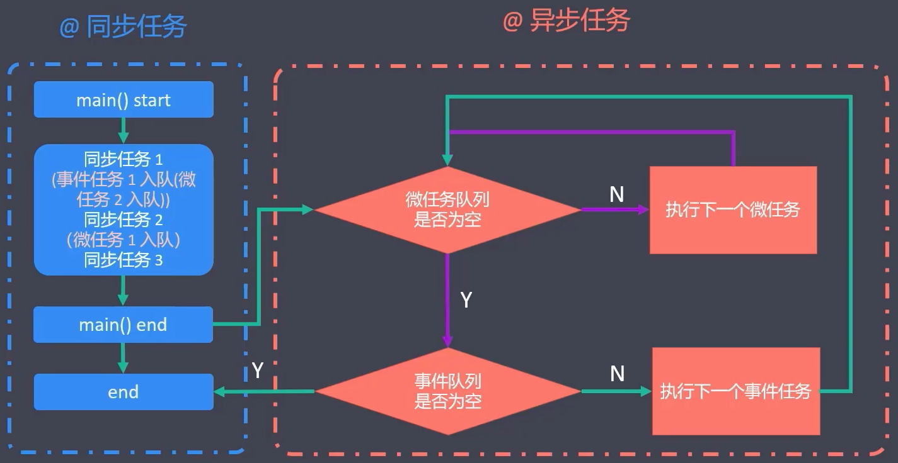
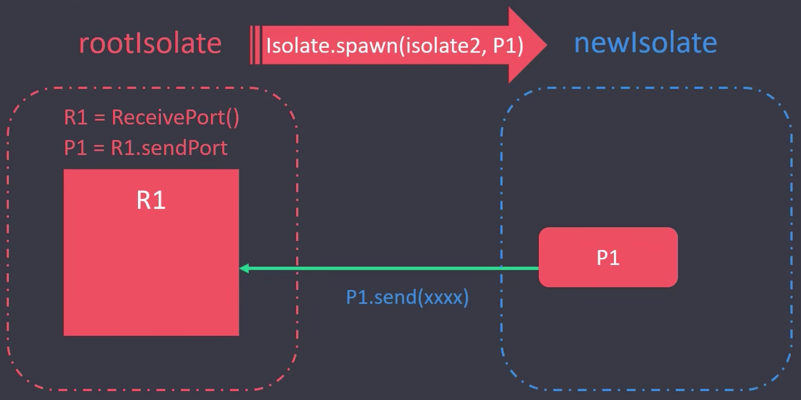
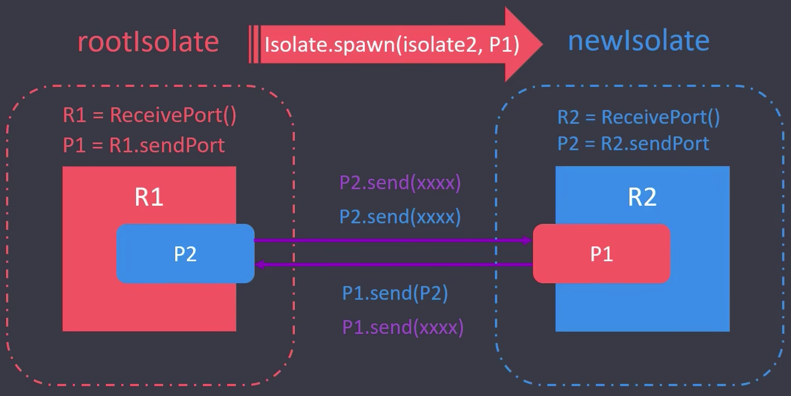

# Extension（扩展）

- `extension` 关键字在 Dart 2.7 及其以上才支持
  - sdk：">=2.7.0 <3.0.0"
- `extension` 可以扩展对象的内容
  - *`extension StringExtension on String { 扩展的内容 }`* 
  - 扩展不仅可以定义方法，还可以定义setter、getter、operator
- 使用
  - 声明扩展
  - 引入扩展
  - 使用扩展（String.扩展内容）

代码示例：

```dart
// 扩展内置类
extension StringExtension on String {
  // 将字符串形式的数字，转成数字
  parseInt() {
    return int.parse(this);
  }
}

// 扩展自定义类
class Person {
  say() {
    print("Say something");
  }
}

extension StudentPerson on Person {
  study() {
    print("Study hard");
  }
}

void main(List<String> args) {
  String number = "20";
  print(number.parseInt());

  Person p = Person();
  p.say();
  p.study();
}
```

# call

- 在类中可以声明 `call` 方法（方法名不能变）
- 当我们将类的实例，用作函数时，会自动调用 `call` 方法

代码示例：

```dart
class IOSPhone {
  IOSPhone() {
    print("Constructor");
  }

  call(String num) {
    print("Phone num is $num.");
  }
}

void main(List<String> args) {
  var phone = IOSPhone(); // 实例化对象时，会自动调用构造函数
  phone("911"); // 将类对象，用作函数名 - 调用 call 方法

  IOSPhone()("911"); // 简写
}
```

# noSuchMethod

- 当我们调用了一个类的，未定的方法时，Dart 会自动调用 `noSuchMethod`
- 使用前提
  - 类中声明了 `noSuchMethod`（否则调默认的 noSuchMethod ）
  - 实例化对象必须用 `dynamic` 来修饰
    - `dynamic p = Person()`
  - 调用的是未定义方法（`p.undefinedMethod()`）

代码示例：

```dart
class Person {
  say() {
    print("Say something");
  }

  @override
  noSuchMethod(Invocation invocation) {
    print("【提示】：未定义的方法");
    return super.noSuchMethod(invocation);
  }
}

void main(List<String> args) {
  dynamic p = Person();
  p.say();
  p.running();
}
```

# hashCode

- `hashCode` 是 Dart 对象的唯一标识
- `hashCode` 表现为一串数字
- Dart 中的每个对象都有 `hashCode`
- 我们可以通过 `hashCode` 来判断两个对象是否相等

代码示例：

```dart
class Person {
  say() {
    print("Say something");
  }
}

// -- 单例
class Singleton {
  static Singleton instance;

  Singleton._internal();

  static getInstance() {
    if (instance == null) {
      instance = Singleton._internal();
    }
  }

  factory Singleton() => getInstance();
}

void main(List<String> args) {
  var p1 = Person();
  var p2 = Person();
  print(p1.hashCode);
  print(p2.hashCode);
  print(p1 == p2); // false

  var s1 = Singleton();
  var s2 = Singleton();
  print(s1.hashCode);
  print(s2.hashCode);
  print(s1 == s2); // true
}

```

# typedef

- `typedef` 可以用来自定义类型（别名），目的是让程序的可读性更强。
  - 我们可以在声明泛型时，使用自定义的类型
- 语法：
  - `typedef function_name( parameters )`
  - `typedef variable_name = List<int>`
- 版本声明
  - sdk：>=2.13.0 <3.0.0
  - 2.13之前，typedef 仅限于函数类型
  - 2.13之后，typedef 可以定义非函数类型

代码示例：

```dart
typedef MathOperation(int a, int b);

// 声明加法运算
plus(int a, int b) {
  print("加法运算：${a + b}");
  return a + b;
}

add(int a, int b, int c) {
  print("加法运算：${a + b + c}");
  return a + b + c;
}

// 声明减法运算
minus(int a, int b) {
  print("减法运算：${a - b}");
  return a - b;
}

// 计算器
calculator(int a, int b, MathOperation op) {
  print("计算器");
  op(a, b);
}

void main(List<String> args) {
  print(add is MathOperation); // false
  print(add is Function); // true

  print(plus is MathOperation); // true
  print(plus is Function); // true

  print(minus is MathOperation); // true
  print(minus is Function); // true

  MathOperation op = plus;
  op(20, 10); // 加法运算：30

  op = minus;
  op(20, 10); // 加法运算：30

  calculator(8, 5, plus);
  calculator(8, 5, minus);
}
```

# Dart 异步编程

## 单线程（EventLoop）

- Dart 单线程的核心包括：主线程、微任务和宏任务（类似于 JavaScript）
  - 微任务队列
    - 微任务队列包含微任务，主要通过 scheduleMicrotask  来调度
  - 事件队列（宏任务）
    - 事件队列包含外部事件，例如 I/O、Timer、绘制事件等
- 同步与异步
  - 同步（4 x 100米）
  - 异步（100米中有8个跑道）



大致流程：

1）首先同步执行主执行栈，判断如果是同步任务，则直接执行，如果是宏任务，放入宏任务队列，如果是微任务，放入微任务队列。

2）执行微任务队列

3）执行宏任务队列

4）完成一次事件循环

代码示例：

```dart
import 'dart:async';

void main(List<String> args) {
  print("flow start"); // 执行打印开始

  // 执行判断为事件任务，添加到事件任务队列
  Timer.run(() {
    print("event-A"); // 执行事件任务，打印事件任务标记

    // 执行判断为微任务，添加到微任务队列
    scheduleMicrotask(() {
      print("microtask-B in event-A"); // 执行微任务，打印微任务标记
    });

    // 执行判断为微任务，添加到微任务队列
    scheduleMicrotask(() {
      print("microtask-C in event-A"); // 执行微任务，打印微任务标记
    });
  });

  // 执行判断为微任务，添加到微任务队列
  scheduleMicrotask(() {
    print("microtask-A"); // 执行微任务，打印微任务标记

    // 执行判断为事件任务，添加到事件任务队列
    Timer.run(() {
      print("event-B in microtask-A"); // 执行事件任务，打印事件任务标记
    });
  });

  print('flow end'); // 打印结束标记
}

// 控制台输出：
flow start
flow end
microtask-A
event-A
microtask-B in event-A
microtask-C in event-A
event-B in microtask-A
```

## Isolate 多线程

### 概述

- Isolate 是 Dart 中的线程
  - Dart 中的线程是以 **隔离（Isolate）** 的方式存在的
  - 每个 Isolate 都有自己独立的，私有内存块（**多个线程不共享内存**）
  - 没有共享内存，就不需要竞争资源，就不需要锁（不用担心死锁问题）
- 所有的 Dart 代码，都运行在 Isolate 中
  - Isolate 提供了 Dart | Flutter 的运行环境
  - 微任务队列、事件队列、时间轮询（event-loop）都在 Isolate 中进行
- 多线程经常用来解决耗时较长的异步任务

### 创建

**Isolate** 类用来管理线程（创建、暂停、杀死 Isolate 线程），常用API：

- `Isolate.spawn()`：创建线程
- `Isolate.spawnUri()`：创建线程（调用其他文件声明的函数）
- `Isolate.pause()`：暂停线程
- `Isolate.kill()`：杀死线程

接下来重点看一下创建线程的API，其语法形式为：

```dart
import 'dart:isolate';
Future<Isolate> Isolate.spawn(entryPoint, message);
```

参数解读：

- `entryPoint`
  - 必须是一个顶层方法或静态方法
- `message`
  - ① Dart 原始数据类型，如null、bool、int、double、String等
  - ② SendPort 实例 - `ReceivePort().sendPort`
  - 包含 ① 和 ② 的 list 和 map，也可以嵌套

代码示例：

```dart
import 'dart:isolate';

void main(List<String> args) {
  multiThread();
}

void newThread1(String message) {
  print("当前线程：" + Isolate.current.debugName);
  print(message);
}

void newThread2(String message) {
  print("当前线程：" + Isolate.current.debugName);
  print(message);
}

void newThread3(String message) {
  print("当前线程：" + Isolate.current.debugName);
  print(message);
}

void multiThread() {
  print("multiThread start");

  print("当前线程：" + Isolate.current.debugName);
  // -- 开辟线程
  Isolate.spawn(newThread1, 'Hello1');
  Isolate.spawn(newThread2, 'Hello2');
  Isolate.spawn(newThread3, 'Hello3');

  print("multiThread end");
}

```

### 通信机制

- Isolate 多线程之间，通信的唯一方式是 `Port`

- **ReceivePort** 

  - 初始化接收端口，创建发送端口，接收消息，监听消息，关闭端口

- **SendPort**

  - 将消息发送给 ReceivePort

- 通信方式

  - 单向通信（A → B）

    

  - 双向通信（A ↔ B）

    

    

代码示例1：单向通信

```dart
import 'dart:isolate';

void main(List<String> args) {
  multiThread();
}

void multiThread() async {
  print("当前线程：" + Isolate.current.debugName);

  // -- 创建通信：接收对象/发送对象
  ReceivePort r1 = ReceivePort();
  SendPort p1 = r1.sendPort;
  // -- 开辟新线程
  Isolate.spawn(newThread, p1);
  // -- 接收新线程发送过来的消息
  r1.listen((msg) {
    print("来自新线程的消息：$msg");
    r1.close();
  });
}

void newThread(SendPort p1) {
  print("当前线程：" + Isolate.current.debugName);
  // -- 发送消息给main线程
  p1.send("Hello，我是新线程！");
}
```

代码示例2：双向通信

```dart
import 'dart:isolate';

void main(List<String> args) {
  multiThread();
}

void multiThread() async {
  print("当前线程：" + Isolate.current.debugName);

  // -- 创建通信：接收对象/发送对象
  ReceivePort r1 = ReceivePort();
  SendPort p1 = r1.sendPort;
  // -- 开辟新线程
  Isolate.spawn(newThread, p1);

  // -- 接收新线程传递过来的SendPort
  SendPort p2 = await r1.first;

  // -- 发送消息给新线程/接收新线程传回的消息
  var msg = await sendToReceive(p2, "Hello，我是主线程！");
  print("主线程接收到：$msg");
}

void newThread(SendPort p1) async {
  print("当前线程：" + Isolate.current.debugName);

  // -- 创建通信：接收对象/发送对象
  ReceivePort r2 = ReceivePort();
  SendPort p2 = r2.sendPort;

  // -- 发送消息给main线程
  p1.send(p2);
  await for (var msg in r2) {
    var data = msg[0];
    print("新线程收到了来自主线程的消息：$data");
    SendPort replyPort = msg[1];
    // 给主线程回复消息
    replyPort.send("已收到~");
  }
}

Future sendToReceive(SendPort port, msg) {
  print("发送消息给新线程：$msg");
  ReceivePort response = ReceivePort();
  port.send([msg, response.sendPort]);
  return response.first;
}
```

代码示例3：

```dart
import 'dart:isolate';

void main(List<String> args) {
  start();

  // 执行耗时操作
  newIsolate();

  init();
}

void start() {
  print("应用启动：" + DateTime.now().microsecondsSinceEpoch.toString());
}

void newIsolate() async {
  print("新线程创建");

  ReceivePort r = ReceivePort();
  SendPort p = r.sendPort;
  // 创建新线程
  Isolate childIsolate = await Isolate.spawnUri(
    Uri(path: "./childIsolate.dart"),
    ["data1", "data2"],
    p,
  );
  // 监听消息
  r.listen((message) {
    print("主线程接收到数据：$message[0]");
    if (message[1] == 1) {
      // 异步任务正在处理
    } else if (message[1] == 2) {
      // 异步任务处理完成
      r.close(); // 取消监听
      childIsolate.kill(); // 杀死新线程，释放资源
      print("子线程已经释放");
    }
  });
}

void init() {
  print("项目初始化...");
}
```

## Future

- 概念
  - Future 是 Dart 中的类，我们可以通过 Future 实例，封装一些异步任务
  - Future 的含义是未来。未来要执行的一些任务，我们可以放到 Future 中

- Future 有三种状态
  - 未完成（Uncompleted）
  - 已完成，并返回数据（Completed with data）
  - 已完成，但返回报错（Completed with error）
- 类似于 JavaScript 中的 Promise

### 获取 Future 实例

- 自动返回

  ```dart
  final myFuture = http.get('xxx');
  final myFuture = SharedPreferences.getInstance;
  ```

- 手动创建

  ```dart
  final myFuture = Future((){ return 123; });
  final myFuture = Future.error(Exception());
  final myFuture = Future.delayed(Duration(seconds:5), () => 123);
  ```

- 状态相关

  - 创建
    - Uncompleted
  - `then()`
    - Completed with data
  - `catchError()`
    - Completed with error
  - `whenComplete()`
    - Completed with data + Completed with error

### Future 的执行顺序

- Future 默认是异步任务，会被丢到事件队列（event queue）中
- `Future.sync()`
  - 同步任务，同步执行（不会被丢到异步队列中）
- `Future.microtask()`
  - 微任务，会丢到 microtask queue 中，优先级比事件任务搞
- `Future.value(val)`
  - val 是常量（等同于 microtask）
  - val 是异步（按照异步逻辑处理）

代码示例：

```dart
void main(List<String> args) {
  print("start");

  Future(() => print("Future() task")); // event queue
  Future.sync(() => print("Future.sync() task"));

  // 如果 value 后面的值是异步，则按照异步的逻辑进行处理
  Future.value(Future(() => print("Future.value future task")));

  // 如果 value 后面的值，是常量，那么，Future.value 创建的微任务
  Future.value('Future.value() const task').then((value) => print(value));

  Future.microtask(() => print("Future.microtask() task")); // microtask queue

  print("end");
}
```

控制台输出：
```
start
Future.sync() task
end
Future.value() const task
Future.microtask() task
Future() task
Future.value future task
```


### Future 多任务

- Future.any(futures)
  - 返回最先完成的 Future 结果
- Future.wait(futures)
  - 等待所有 Future 执行完成，并收集所有 Future 的返回结果
- Future.doWhile(action)
  - 按照条件遍历执行多个 Future
- Future.forEach(elements, action)
  - 遍历一个给定的集合，根据集合元素执行多个 Future

> **代码示例1：`Future.any`**

```dart
void main(List<String> args) {
  print("start");

  // 返回最先完成的异步任务
  Future.any([
    Future.delayed(Duration(seconds: 4)).then((value) => 1),
    Future.delayed(Duration(seconds: 2)).then((value) => 2),
    Future.delayed(Duration(seconds: 3)).then((value) => 3),
  ]).then((value) => print("多个 Future 的最快的返回结果是：$value"));

  print("end");
}
```

控制台输出：

```
start
end
多个 Future 的最快的返回及果实：2
```


> **代码示例2：`Future.wait`**

```dart
void main(List<String> args) {
  print("start");

  // 等待所有异步任务完成，并收集所有异步任务执行的结果
  Future.wait([
    Future.delayed(Duration(seconds: 4)).then((value) {
      print("Future 1");
      return 1;
    }),
    Future.delayed(Duration(seconds: 2)).then((value) {
      print("Future 2");
      return 2;
    }),
    Future.delayed(Duration(seconds: 3)).then((value) {
      print("Future 3");
      return 3;
    }),
  ]).then((value) {
    print("所有 Future 的执行结果是：$value");
  });

  print("end");
}

```

控制台输出：

```
start
end
Future 2
Future 3
Future 1
所有 Future 的执行结果是：[1, 2, 3]
```

> **代码示例3：`Future.doWhile`**

```dart
void main(List<String> args) {
  var i = 0;
  Future.doWhile(() {
    i++;
    return Future.delayed(Duration(seconds: 2), () {
      var now = DateTime.now().microsecondsSinceEpoch.toString();
      print("Future.doWhile() $i, 当前时间：$now");
      return i < 4;
    }).then((value) {
      print(value);
      return value;
    });
  }).then((value) {
    print("Future.doWhile() then：$value");
  });
}
```

控制台输出：

```
Future.doWhile() 1, 当前时间：1667525887935947
true
Future.doWhile() 2, 当前时间：1667525889942402
true
Future.doWhile() 3, 当前时间：1667525891944631
true
Future.doWhile() 4, 当前时间：1667525893946566
false
Future.doWhile() then：null
```

> **代码示例4：`Future.forEach`**

```dart
void main(List<String> args) {
  Future.forEach([1, 2, 3], (element) {
    return Future.delayed(Duration(seconds: 1), () {
      print("当前元素：$element");
      return element * 2;
    }).then((value) => print("处理后的结果：$value"));
  });
}
```

控制台输出：

```
当前元素：1
处理后的结果：2
当前元素：2
处理后的结果：4
当前元素：3
处理后的结果：6
```

### FutureBuilder

- FutureBuilder 是 **Flutter SDK** 中提供的异步组件。
  - FutureBuilder 是一个类，接收 Future 数据，并将数据渲染成界面
  - *`import 'package:flutter/material.dart'`*
- FutureBuilder 中，有三个属性：
  - future
  - initialData
  - builder(context, snapshot)
    - snapshot.connectionState
      - ConnectionState.none（未连接异步任务）
      - ConnectionState.waiting（连接异步任务，等待交互）
      - ConnectionState.active（正在交互）
      - ConnectionState.done（异步任务完成）
    - snapshot.hasData（Completed with data）
      - snapshot.data（读取数据）
    - snapshot.hasError（Completed with error）

> **伪代码示例**

```dart
FutureBuilder(
  future: getData,
  builder: (context, snapshot) {
    switch(snapshot.connectionState) {
      case ConnectionState.none: 
      case ConnectionState.active: 
      case ConnectionState.waiting: 
        print("waiting...");
        return null;
      case ConnectionState.done: 
        if(snapshot.hasError) {
          print("error");
          return null;
        }else {
          print("done");
          return snapshot.data;
        }
    }
    return const Text("Hello, Flutter！");
  }
);
```

## Stream

- Stream 是 Dart 中的异步数据流，可以连续不断的返回多个数据。
  - Future（异步），返回一个值
  - Stream（异步），返回多个值（数据流）

- Stream 相关的 API
  - **通过 `listen` 进行数据监听**
  - 通过 `error` 接收失败状态
  - 通过 `done` 来接收结束状态

### Stream 类型

- Single-Subscription（单一订阅）
  - 数据流只能被 listen 一次（listen 多次会报错）
  - StreamController().stream
  - Stream stream = Stream.fromIterable(data)
- Broadcast（广播）
  - 数据流可以被 listen 多次
  - StreamController\<int>.broadcast()
  - stream.asBroadcastStream()

> **代码示例1：单一数据流**

```dart
void main(List<String> args) {
  // 创建单一订阅数据流
  final StreamController controller = StreamController();
  // 第一次监听
  controller.stream.listen((event) {
    print("Data is $event.");
  });
  // 第二次监听 - 会报错
  /*controller.stream.listen((event) {
    print("Data is $event.");
  });*/

  // 给数据流添加数据
  controller.sink.add("abc");
  controller.sink.add("123");
}
```

> **代码示例2：广播**

```dart
void main(List<String> args) {
  // 创建广播流
  StreamController controller = StreamController.broadcast();

  // 第一次监听
  controller.stream.listen((event) {
    print("Data1 is $event.");
  });
  // 给数据流添加数据
  controller.sink.add("abc");

  // 第二次监听
  controller.stream.listen((event) {
    print("Data2 is $event.");
  });
  // 给数据流添加数据
  controller.sink.add("123");
}
```

### 创建 Stream 实例

- StreamController 类
  - sink
  - stream
- Stream 类
  - Stream.fromFuture()
  - Stream.fromFutures()
  - Stream.fromIterable()
  - Stream.periodic() --- *类似于JavaScript中的setInterval*

> **代码示例1：`Stream.fromFuture()`**

```dart

Future<String> getData() {
  return Future.delayed(Duration(seconds: 2), () {
    return "当前时间 → ${DateTime.now()}";
  });
}

void main(List<String> args) {
  Stream.fromFuture(getData()).listen((event) {
    print("Stream.fromFuture: $event");
  }).onDone(() {
    print("Stream.fromFuture done.");
  });
}
```

> **代码示例2：`Stream.fromFutures()`**

```dart
Future<String> getData() {
  return Future.delayed(Duration(seconds: 2), () {
    return "当前时间 → ${DateTime.now()}";
  });
}

void main(List<String> args) {
  var data = [getData(), getData(), getData()];
  Stream.fromFutures(data).listen((event) {
    print("Stream.fromFutures: $event");
  }).onDone(() {
    print("Stream.fromFutures done.");
  });
}
```

> **代码示例3：`Stream.fromIterable()`**

```dart
void main(List<String> args) {
  var data = [1, 2, "Hello", true, null];
  Stream.fromIterable(data).listen((event) {
    print("Stream.fromIterable: $event");
  }).onDone(() {
    print("Stream.fromIterable done.");
  });
}
```

> **代码示例4：`Stream.periodic()`**

```dart
void main(List<String> args) {
  Duration interval = Duration(seconds: 1);

  // 如果不设置第2个参数，则默认返回null
  // Stream<int> stream = Stream<int>.periodic(interval);
  // stream.listen((event) {
  //   print("Stream.periodic: $event");
  // }).onDone(() {
  //   print("Stream.periodic done.");
  // });

  // 带有第2个参数，则返回具体的数据
  Stream<int> streamData = Stream<int>.periodic(interval, (data) => data);
  streamData.listen((event) {
    print("Stream.periodic: $event");
  }).onDone(() {
    print("Stream.periodic done.");
  });
}
```

### 操作 Stream

- `take()` | `takeWhile()`：指定返回数量
- `where()`：过滤
- `distinct()`：过滤重复数据
- `skip()` | `skipWhile()`：跳过某些数据
- `map()`
- `toSet()` | `toList` | `toString()`
- `length` | `first` | `last`

> **代码示例1：`take`**

```dart
void main(List<String> args) {
  Duration interval = Duration(seconds: 1);

  Stream<int> streamData = Stream<int>.periodic(interval, (data) => data);

  // 指定接收次数
  streamData.take(5).listen((event) {
    print("Stream.periodic → $event.");
  }).onDone(() {
    print("Stream.periodic → done.");
  });
}

Stream.periodic → 0.
Stream.periodic → 1.
Stream.periodic → 2.
Stream.periodic → 3.
Stream.periodic → 4.
Stream.periodic → done.
```

> **代码示例2：`takeWhile`**

```dart
void main(List<String> args) {
  Duration interval = Duration(seconds: 1);

  Stream<int> streamData = Stream<int>.periodic(interval, (data) => data);

  // 指定接收次数
  streamData.takeWhile((element) {
    print("Stream.periodic.takeWhile → $element.");
    return element <= 3;
  }).listen((event) {
    print("Stream.periodic → $event.");
  }).onDone(() {
    print("Stream.periodic → done.");
  });
}

Stream.periodic.takeWhile → 0.
Stream.periodic → 0.
Stream.periodic.takeWhile → 1.
Stream.periodic → 1.
Stream.periodic.takeWhile → 2.
Stream.periodic → 2.
Stream.periodic.takeWhile → 3.
Stream.periodic → 3.
Stream.periodic.takeWhile → 4.
Stream.periodic → done.
```

> **代码示例3：`where`**

```dart
void main(List<String> args) {
  Duration interval = Duration(seconds: 1);

  Stream<int> streamData = Stream<int>.periodic(interval, (data) => data);

  streamData.takeWhile((element) {
    // print("Stream.periodic.takeWhile → $element.");
    return element <= 3;
  }).where((data) {
    // print("where → $data.");
    return data % 2 == 0; // 返回偶数
  }).listen((event) {
    print("Stream.periodic → $event.");
  }).onDone(() {
    print("Stream.periodic → done.");
  });
}

Stream.periodic → 0.
Stream.periodic → 2.
Stream.periodic → done.
```

> **代码示例4：`distinct`**

```dart
void main(List<String> args) {
  var data = [1, 2, 'a', 'a', true, true, false, true, 'a'];
  Stream.fromIterable(data)
      .distinct() // 去掉与【前一个】相同的数据（连续重复的值）
      .listen((event) => print("Stream.fromIterable → $event."))
      .onDone(() => print("Stream.fromIterable → done."));
}

Stream.fromIterable → 1.
Stream.fromIterable → 2.
Stream.fromIterable → a.
Stream.fromIterable → true.
Stream.fromIterable → false.
Stream.fromIterable → true.
Stream.fromIterable → a.
Stream.fromIterable → done.
```

> **代码示例5：`skip`**

```dart
void main(List<String> args) {
  Duration interval = Duration(seconds: 1);

  Stream<int> streamData = Stream<int>.periodic(interval, (data) => data);

  streamData
      .takeWhile((element) {
        return element <= 6;
      })
      .skip(2)
      .listen((event) {
        print("--：$event.");
      })
      .onDone(() {
        print("done.");
      });
}

--：2.
--：3.
--：4.
--：5.
--：6.
done.
```

> **代码示例6：`skipWhile`**

```dart
void main(List<String> args) {
  Duration interval = Duration(seconds: 1);

  Stream<int> streamData = Stream<int>.periodic(interval, (data) => data);

  streamData.takeWhile((element) {
    return element <= 6;
  }).skipWhile((element) {
    return element <= 3;
  }).listen((event) {
    print("--：$event.");
  }).onDone(() {
    print("done.");
  });
}

skipWhile：0
skipWhile：1
skipWhile：2
skipWhile：3
skipWhile：4
--：4.
--：5.
--：6.
done.
```

> **代码示例7：`map`**

```dart
void main(List<String> args) {
  Duration interval = Duration(seconds: 1);

  Stream<int> streamData = Stream<int>.periodic(interval, (data) => data + 1);

  streamData.takeWhile((element) {
    return element <= 6;
  }).map((event) {
    print("map：$event * 100 = ${event * 100}");
    return event * 100;
  }).listen((event) {
    print("listen：$event.");
  }).onDone(() {
    print("done.");
  });
}

map：1 * 100 = 100
listen：100.
map：2 * 100 = 200
listen：200.
map：3 * 100 = 300
listen：300.
map：4 * 100 = 400
listen：400.
map：5 * 100 = 500
listen：500.
map：6 * 100 = 600
listen：600.
done.
```

> **代码示例8：`expand`**

```dart
void main(List<String> args) {
  Duration interval = Duration(seconds: 1);

  Stream<int> streamData = Stream<int>.periodic(interval, (data) => data + 1);

  streamData.takeWhile((element) {
    return element <= 3;
  }).expand((element) {
    print("expand → $element → ${element * 10} → ${element * 100}");
    return [element, element * 10, element * 100];
  }).listen((event) {
    print("listen：$event.");
  }).onDone(() {
    print("done.");
  });
}

expand → 1 → 10 → 100
listen：1.
listen：10.
listen：100.
expand → 2 → 20 → 200
listen：2.
listen：20.
listen：200.
expand → 3 → 30 → 300
listen：3.
listen：30.
listen：300.
done.
```

### StreamBuilder

- StreamBuilder 是 Flutter SDK 中提供的异步组件
  - StreamBuilder 是一个类，接收 Stream 数据，并将数据渲染成页面
  - *`import 'package:flutter/material.dart'`*
- StreamBuilder 中，有三个属性
  - stream
  - initialData
  - builder(context, snapshot)
    - snapshot.connectionState
      - ConnectionState.none（未连接异步任务）
      - ConnectionState.waiting（连接异步任务，等待交互）
      - ConnectionState.active（正在交互）
      - ConnectionState.done（异步任务完成）
    - snapshot.hasData（Completed with data）
      - snapshot.data（读取数据）
    - snapshot.hasError（Completed with error）

> **Tips：**StreamBuilder 与 FutureBuilder 类似

## Isolate、Future、Stream Compare *

- Future：异步返回一个值
- Stream：异步返回一系列的值（数据流）
- Isolate：通过创建新线程的方式，来实现异步

### Isolate 与 Fture 如何选择？

- 两者都可以执行异步操作，但逻辑不通
- Isolate 的开销比 Future 要大
  - Isolate 需要重新开启线程，Future 是单线程内的异步任务
- **异步任务耗时短，推荐使用 Future，耗时长，推荐使用 Isolate**
  - 如果使用 Future 来处理耗时长的异步任务，会造成阻塞
  - 耗时 <100ms 选 Future；耗时 > 100 毫秒 选 Isolate

## Async / Await

- async：标记函数是一个异步函数，其返回值类型是 Future
- await：等待某个异步方法执行完毕
  - 用来等待耗时操作的返回结果，这个操作会阻塞到后面的代码

- 作用：
  - await 会等待异步任务执行（相当于将异步转成同步）
  - Async-await 简化代码，防止回调地狱的产生

## Generator

- 什么是生成器
  - 生成器是一种特殊的函数，返回值通过 `yield` 关键词来指定
- 生成器的分类
  - 同步生成器（sync + yield）
    - 使用 sync*，返回的是 Iterable 对象
    - yield 会返回 moveNext 为 true，并等待 moveNext 指令
  - 异步生成器（async + tield）
    - 使用 async*，返回的是 Stream 对象
    - yield 不用暂停，数据以流的方式一次性推送
  - 递归生成器（yield*）
    - yield* 是指针，指向递归函数

| 类型       | 关键字   | 单个值      | 零个或多个值   |
| ---------- | -------- | ----------- | -------------- |
| 同步生成器 | `sync*`  | int         | Iterable\<int> |
| 异步生成器 | `async*` | Fture\<int> | Stream\<int>   |

> **代码示例1：`sync + yield`**

```dart
void main(List<String> args) {
  var res = getNumber(5).iterator;
  while (res.moveNext()) {
    print(res.current);
  }
  // res.moveNext(); print(res.current);
  // res.moveNext(); print(res.current);
  // res.moveNext(); print(res.current);
  // res.moveNext(); print(res.current);
  // res.moveNext(); print(res.current);
  // res.moveNext(); print(res.current);
}

// 同步生成器
Iterable<int> getNumber(int n) sync* {
  int i = 0;
  while (i < n) {
    yield i++;
  }
  print("end");
}
```

> **代码示例2：`async + yield`**

```dart
void main(List<String> args) {
  final Stream<int> s = asyncCountDown(5);

  print("Start");
  s.listen((event) {
    print(event);
  }).onDone(() {
    print("Done");
  });
  print("End");
}

// 异步生成器
Stream<int> asyncCountDown(int n) async* {
  while (n > 0) {
    yield n--;
  }
}
```

## 递归生成器

| 类型                 | 同步/异步 | yield    |
| -------------------- | --------- | -------- |
| **同步** 生成器      | `sync*`   | `yield`  |
| 递归 **同步** 生成器 | `sync*`   | `yield*` |
| **异步** 生成器      | `async*`  | `yield`  |
| 递归 **异步** 生成器 | `async*`  | `yield*` |

代码示例：

```dart
void main(List<String> args) {
  final Iterable<int> s = getRange(1, 6);

  print("Start");

  s.forEach((element) {
    print(element);
  });

  print("End");
}

// 同步递归生成器
Iterable<int> getRange(int start, int end) sync* {
  if (start <= end) {
    yield start;
    // 实现递归调用
    // for (final val in getRange(start + 1, end)) {
    //   yield val;
    // }
    yield* getRange(start + 1, end);
  }
}
```

