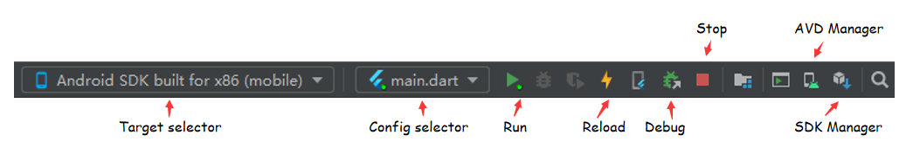
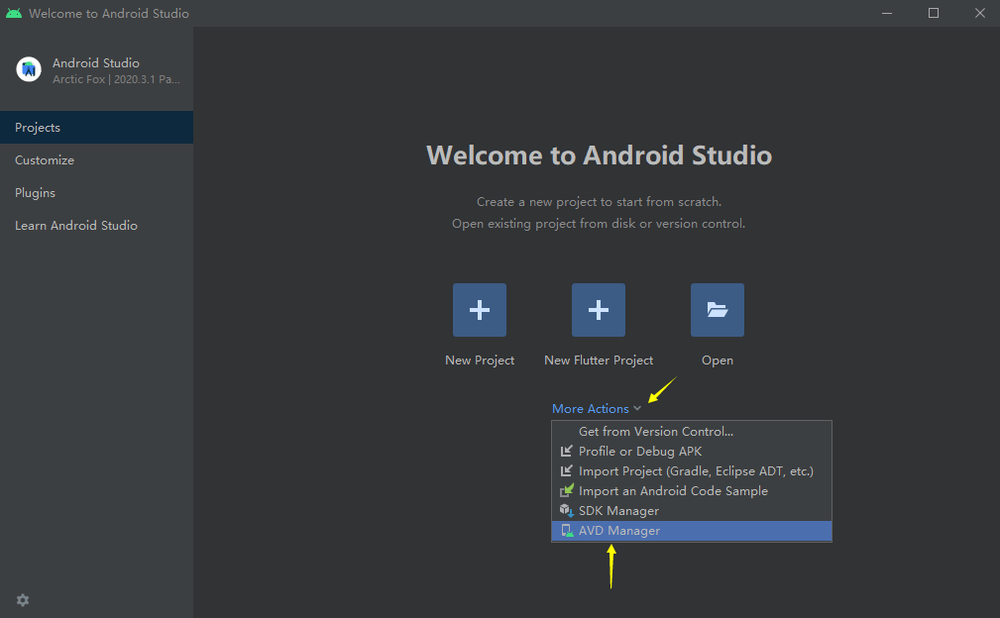
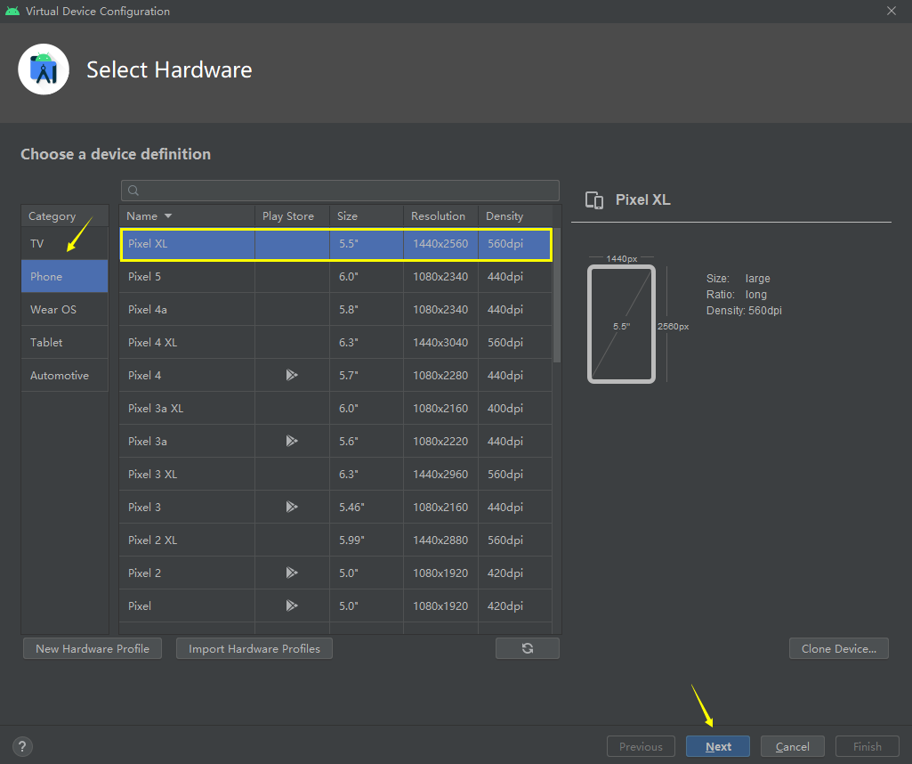
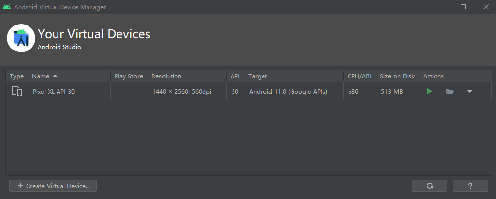

# 概述

- Flutter 是 Google 开发的一款开源的、免费的，基于 **Dart 语言** 的UI框架，可以快速在 iOS 和 Android 上构建高质量的原生应用

  它最大的特点就是 **跨平台** 和 **高性能**。

- Dart 是由 Google，在2011年开发的计算机编程语言，它可以被用于 Web、服务器、移动应用和物联网等多个领域。号称要取代 JavaScript。

- 资源网站

  - 官网

    - https://flutter.dev/
  - GitHub
  
    - https://github.com/flutter/flutter
  - 中文网

    - https://flutterchina.club/

    - https://flutter.cn/
  - 工具包
  - https://pub.flutter-io.cn/

> 提示：如果没有任何 Dart 语言的基础，不建议直接学习 Flutter。建议先学习Dart语言的基本语法。

# 环境配置

工欲善其事必先利其器，本节首先会分别介绍一下在Windows和macOS下Flutter SDK的安装，然后再介绍一下配IDE和模拟器的使用。

## windows

### 使用镜像

由于在国内访问Flutter有时可能会受到限制，Flutter官方为中国开发者搭建了临时镜像，大家可以将如下环境变量加入到用户环境变量中：

```json
{
    PUB_HOSTED_URL:"https://pub.flutter-io.cn"
	FLUTTER_STORAGE_BASE_UR:"https://storage.flutter-io.cn"
}
```

设置步骤：`开始` → `搜索 env` → `编辑系统环境变量` → `环境变量` → `新建（用户变量）` → `填写变量名和变量值`  → `确定保存`

**注意：** 此镜像为临时镜像，并不能保证一直可用，读者可以参考 [这里 >>](https://docs.flutter.dev/community/china#configuring-flutter-to-use-a-mirror-site) 以获得有关镜像服务器的最新动态

### 下载配置Flutter SDK

**① 下载SDK**

[Flutter SDK >>](https://flutter.cn/docs/development/tools/sdk/releases?tab=windows)：

选择 `Stable channel (Windows)` 中的最新版本。

> 提示：要想正常获取安装包列表或下载安装包，可能需要梯子，读者也可以去Flutter github项目下去 [下载安装包 >>](https://github.com/flutter/flutter/tags)

**② 解压**

接下来把下载好的 Flutter SDK 随便解压到你想安装SDK 的目录，（如：`E:\flutter`）

> 注意：**不要**将 `flutter` 安装到需要一些高权限的路径如：`C:\Program Files\`

**③ 配置环境变量**

将刚解压的 Flutter SDK 中的 `/bin` 目录加入系统变量 `Path` 字段中，比如我这里是：`E:\flutter\bin`

**④ 验证**

`Win + R` 打开 CMD，输入指令 `flutter --version`，如果能打印出相关信息则表示 `Flutter SDK` 配置成功。

### 安装 Android Studio

下载并安装 [Android Studio >>](https://developer.android.com/studio) 

> 提示：下载好之后，双击 `.exe` 文件，根据 Android Studio安装向导，一路执行即可，这将安装最新的Android SDK。Android SDK平台工具和Android SDK构建工具，是Flutter为Android开发时所必需的。

IDE 安装好之后顺便安装一下 `SDK Command-line Tools`：

`Customize` -> `All settings...` -> `Appearance & Behavior` -> `System Settings` -> `Android SDK` -> `SDK Tools` -> 查看 `Android SDK Command-line Tools(latest)` 

### 环境检测

终端输入 `flutter doctor` 命令检测环境是否配置成功。

```shell
$ flutter doctor
Doctor summary (to see all details, run flutter doctor -v):
[√] Flutter (Channel stable, 2.5.3, on Microsoft Windows [Version 10.0.19042.1288], locale zh-CN)
[!] Android toolchain - develop for Android devices (Android SDK version 31.0.0)
    X cmdline-tools component is missing
      Run `path/to/sdkmanager --install "cmdline-tools;latest"`
      See https://developer.android.com/studio/command-line for more details.
    X Android license status unknown.
      Run `flutter doctor --android-licenses` to accept the SDK licenses.
      See https://flutter.dev/docs/get-started/install/windows#android-setup for more details.
[√] Chrome - develop for the web
[√] Android Studio (version 2020.3)
[√] Connected device (2 available)

! Doctor found issues in 1 category.
```

根据提示，解决问题即可！然后再次输入指令检测环境

```shell
$ flutter doctor
Doctor summary (to see all details, run flutter doctor -v):
[√] Flutter (Channel stable, 2.5.3, on Microsoft Windows [Version 10.0.19042.1288], locale zh-CN)
[√] Android toolchain - develop for Android devices (Android SDK version 31.0.0)
[√] Chrome - develop for the web
[√] Android Studio (version 2020.3)
[√] Connected device (2 available)

• No issues found!
```

## macOS

### 下载SDK

1）点击前往 [下载Flutter SDK >>](https://flutter.cn/docs/development/tools/sdk/releases)

> **！提示：**切换至 `macOS` 项选择对应的版本。

2）将下载下来的SDK文件解压缩至指定目录（任意位置），参照： *`/usr/local/flutter `*  

### 配置环境变量

在终端输入 `vi ~/.bash_profile`，按 `i` 进入编辑模式，添加如下代码：

```ini
# 国内镜像
export PUB_HOSTED_URL=https://pub.flutter-io.cn
export FLUTTER_STORAGE_BASE_URL=https://storage.flutter-io.cn
# 环境变量
export FLUTTER=/usr/local/flutter/bin
# 导出
export PATH=$PATH:$FLUTTER
```

刷新配置文件：

```shell
$ source ~/.bash_profile 
```

验证结果：

```shell
$ flutter --version
Flutter 3.3.5 • channel stable • https://github.com/flutter/flutter.git
Framework • revision d9111f6402 (4 days ago) • 2022-10-19 12:27:13 -0700
Engine • revision 3ad69d7be3
Tools • Dart 2.18.2 • DevTools 2.15.0
```

### 检查环境

运行以下命令以查看是否需要安装任何依赖项才能完成设置。

```shell
$ flutter doctor
```

此命令检查您的环境并向终端窗口显示报告。

```shell
Doctor summary (to see all details, run flutter doctor -v):
[✓] Flutter (Channel stable, v1.17.5, on Mac OS X 10.15.3 19D76, locale
    zh-Hans-CN)
[!] Android toolchain - develop for Android devices (Android SDK version 28.0.3)
    ✗ Android license status unknown.
      Try re-installing or updating your Android SDK Manager.
      See https://developer.android.com/studio/#downloads or visit visit
      https://flutter.dev/docs/get-started/install/macos#android-setup for
      detailed instructions.
 
[✓] Xcode - develop for iOS and macOS (Xcode 11.5)
[!] Android Studio (version 3.6)
    ✗ Flutter plugin not installed; this adds Flutter specific functionality.
    ✗ Dart plugin not installed; this adds Dart specific functionality.
[!] VS Code (version 1.46.1)
    ✗ Flutter extension not installed; install from
      https://marketplace.visualstudio.com/items?itemName=Dart-Code.flutter
[!] Connected device
    ! No devices available

! Doctor found issues in 4 categories.
```

按照检测结果的说明，如果有 `[!]` 或者 `✗`  标志，表示本行检测不通过，需要做一些设置或者安装一些软件。

### 1. 下载安装  Android Studio

```
✗ Android license status unknown.
```

下载地址：https://developer.android.com/studio/#downloads

接下来在配置文件里添加如下代码：

```ini
# android
export ANDROID_HOME=$HOME/Library/Android/sdk 
export PATH=$PATH:$ANDROID_HOME/tools
export PATH=$PATH:$ANDROID_HOME/tools/bin
export PATH=$PATH:$ANDROID_HOME/platform-tools
export PATH=$PATH:$ANDROID_HOME/emulator
```

### 2. 安装插件

```
✗ Flutter plugin not installed; this adds Flutter specific functionality.
✗ Dart plugin not installed; this adds Dart specific functionality.
```

打开 `android studio`，找到个人偏好设置，快捷键 `cmd + ,` ，选中 `Plugins` 项，输入 `flutter`，点击 `install`。

配置 Android，一路按 `y` 即可：

```shell
$ flutter doctor --android-licenses
```

此时，安卓环境已经OK。

```
[✓] Android toolchain - develop for Android devices (Android SDK version 28.0.3)
```

### 3.  VS Code

```
 VS Code (version 1.46.1)
    ✗ Flutter extension not installed; install from
      https://marketplace.visualstudio.com/items?itemName=Dart-Code.flutter
```

下载安装：https://code.visualstudio.com/

打开VSCode，快捷键 `CMD` + `SHIFT` + `X` 打开拓展程序，搜索并安装 Dart/Flutter 插件。然后再次执行 `flutter doctor` 指令，配置完毕！

# IDEs

## IDE：Android Studio（推荐）

### 1. 安装插件

- `Flutter`： 支持Flutter开发工作流 （运行、调试、热重载等）
- `Dart`：提供代码分析 （输入代码时进行验证、代码补全等）

1）启动 `Android Studio` 

2）打开插件首选项（macOS：**Preferences → Plugins**，Windows：**File → Settings → Plugins**）

3）`搜索插件` → `Install` → `Restart IDE`

### 2. 创建项目

1）选择 `File` → `New` → `New Flutter Project...` → `Next`

2）配置项目信息 → `Finish`

项目信息：

- `Project name`：项目名称
- `Project location`：项目位置
- `Organization`：包名
- ...

### 3. 运行应用程序

1）定位到 `Android Studio` 工具栏



2）在 `Target selector` 中，选择一个运行该应用的 Android 设备，如果没有列出可用，请选择 `AVD Manager` 并创建一个（参照后文：创建模拟器）。

3）点击 `run`，运行程序。

### 3. 创建模拟器

1）打开 `Android Studio` / 或者在工具栏点击 `AVD Manager` 图标。



> 提示：如果在 `Android Studio` 中打开了项目，则在工具栏找到 `AVD Manager` 的图标点击即可。

2）选择 `+ Create Virtual Device...`

3）选择模拟器



> 提示：你可以根据你的需要选择模拟器的机型。

4）`Select a system image` → 选择 **R** 即可 → `Next`  → `Verify Configuration(可命名虚拟设备)` →  `Finish`



> 提示：上图显示代表创建完成。

## IDE：Visual Studio Code

### 1. 安装IDE

下载安装 [Visual Studio Code >>](https://code.visualstudio.com/)

### 2. 安装插件

- `Flutter`： 支持Flutter开发工作流 (运行、调试、热重载等)
- `Dart`：提供代码分析 (输入代码时进行验证、代码补全等)

步骤：`启动 Visual Studio Code `  → `快捷键：CMD(CTR) + SHIFT + X` → `搜索并安装插件` → `重启 Visual Studio Code`

> **！提示**：安装 `Flutter` 插件时会自动安装 `Dart` 插件。

### 3. 创建项目

步骤：`启动 Visual Studio Code ` → `CMD(CTR) + SHIFT + P`  → `Flutter:New Project` → `Application`  → `Select Folder` → `Enter Project Name`

### 4. 配置模拟器

#### 4.1. Android

**步骤**：`CMD(CTR) + SHIFT + P`  → `Flutter:Select Device` → `+ Create Android emulator` 

如果提示： *No suitable Android AVD system images are available. You may need to install these using sdkmanager, for example: sdkmanager "system-images;android-27;google_apis_playstore;x86"*

在 `Android Studio` 中创建虚拟设备(模拟器) → 重复上次步骤 → 选择设备，耐心等待启动...

#### 4.2. iOS

**Tips**：coming soon...

#### 5. 运行项目

终端输入：`flutter run`

# 通用目录结构

```ini
nodejs
├── android（安卓目录）
├── build（构建目录）
├── lib（开发目录：相当于src目录）
│   ├── entities（实体）
│   ├── generated（生成的静态资源）
│   ├── model（数据层）
│   ├── view（视图层）
│   ├── viewmodel
│   ├── routes（路由映射）
│   ├── utils（工具类）
│   │   ├── constants.dart
│   │   └── http.dart 
│   ├── widgets（全局组件）
│   ├── app.dart（根组件）
│   └── main.dart（入口文件：相当于index.js）
├── pubspec.lock（项目依赖锁定信息，相当于npm中的 package-lock.json）
└── pubspec.yaml（项目依赖配置，相当于npm中的 package.json）
```

